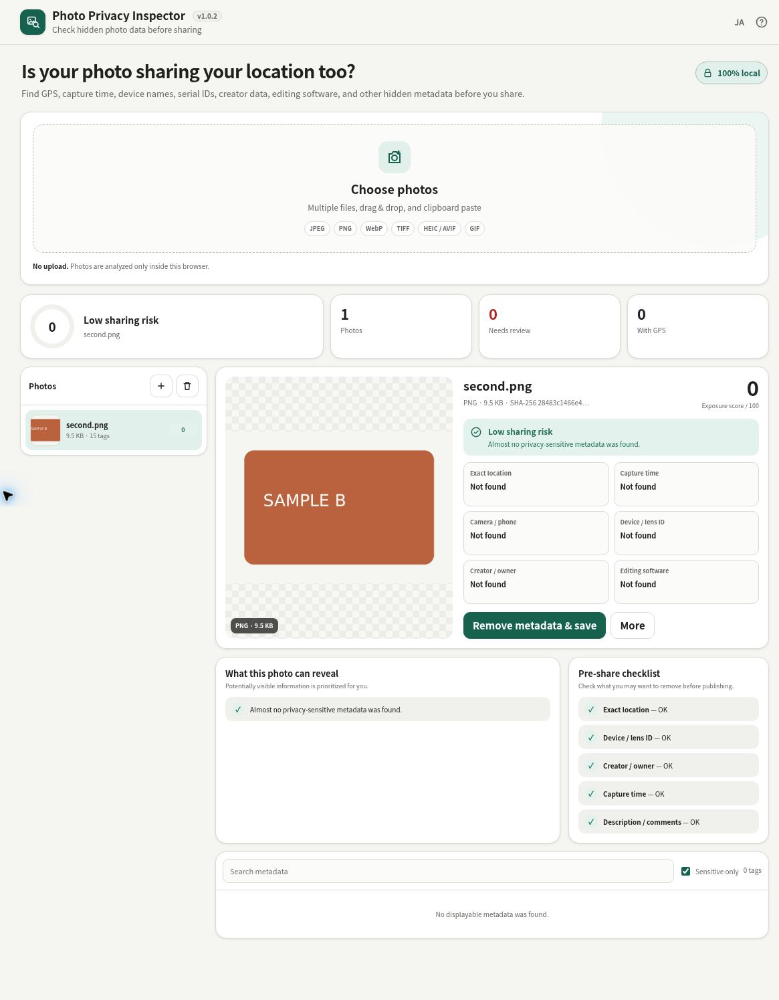

# Photo Privacy Inspector

[日本語版 README](README.ja.md)

A privacy-focused single-HTML app that inspects GPS, capture time, device identifiers, creator fields, editing software, and other hidden photo metadata without uploading your images.

Unlike a basic EXIF viewer, it explains **what a recipient could learn**, assigns an exposure score, removes metadata into share-ready copies, and then re-scans the output to verify what was actually removed.

## 🚀 Live demo

### [Open Photo Privacy Inspector on GitHub Pages](https://ttomohisa.github.io/htmlapps-photo-privacy-inspector/)

After the initial HTML is loaded, metadata parsing, hashing, cleaning, verification, and ZIP creation run locally on your device. Selected images and GPS coordinates are not sent by the app.

## Embedded AI and provenance records

The app checks supported JPEG, PNG and WebP metadata for AI generation/editing declarations, tool names and generation settings. It also detects C2PA provenance containers, separately from AI records. This is a metadata inspection, not a visual AI detector or cryptographic signature verifier. Records can be changed; their absence does not prove a photo is real.

Cleaning removes supported embedded records from the saved copy and checks the result again. **C2PA signatures, provenance and edit history will be lost.** Removal of invisible pixel watermarks such as SynthID is not guaranteed. Unknown proprietary metadata may remain; the original file is unchanged.

## HDR and multi-image JPEGs

Complete concatenated JPEG images, including MPF/HDR gain-map containers, are inspected image by image. Auxiliary metadata contributes to the findings. For these files, **Save an SDR still image** is the explicit supported cleanup route: it re-encodes the primary image and loses HDR brightness and auxiliary images. The original is unchanged, and the saved single-image output is inspected again. No-recompression cleanup is disabled rather than silently damaging HDR linkage. Bulk ZIP omits these files and lists their names; export them individually after reading the warning. Non-JPEG trailers and damaged auxiliary images remain unsupported.

## Features

- Inspect GPS, timestamps, camera/phone model, serial IDs, creator/owner, software, comments, unique IDs, and thumbnails
- Plain-language “What this photo can reveal” summary
- 0–100 exposure score and pre-share checklist
- Offline coordinate visualization with no map-tile requests
- Lossless Privacy Clean for JPEG / PNG / WebP
- Canvas-based Deep Clean fallback
- Automatic post-clean re-inspection with Before → After verification
- Batch analysis and risk triage
- Batch Privacy Clean to ZIP
- Per-photo and batch JSON privacy reports
- Local SHA-256 fingerprinting
- Metadata inspection for JPEG / PNG / WebP / TIFF / HEIC / AVIF / GIF
- Japanese / English UI
- Responsive mobile-first layout

## Quick start

Run `build-standalone.bat` on Windows. The first build downloads the exact dependency versions pinned in `dependencies.json`; later builds reuse the package cache. The generated `dist/index.html` can be opened directly with `file://` and needs no local server, Python, or Node.js.

## Cleaning modes

**Privacy Clean** edits JPEG/PNG/WebP container metadata without recompressing the encoded image payload. Common EXIF, GPS, XMP, IPTC, text, and comment metadata is removed while color-management data is preserved where possible. JPEG and WebP retain only a newly generated minimal EXIF Orientation tag when needed; viewer support for orientation varies. PNG eXIf is removed entirely, including orientation. The output is always parsed again to report any remaining sensitive fields.

**Deep Clean** redraws the image through Canvas and exports a fresh image. This is more aggressive but can recompress JPEG/WebP data and depends on browser decoding support.

## Privacy and runtime network protection

The generated HTML contains a Content Security Policy with `connect-src 'none'`. ExifReader and fflate are embedded at build time, with no runtime CDN. GPS visualization is an offline coordinate grid rather than an external map.

## Dependencies

| Library | Version | License | Purpose |
| --- | ---: | --- | --- |
| ExifReader | 4.41.3 | MPL-2.0 | EXIF / GPS / IPTC / XMP / ICC parsing |
| fflate | 0.8.3 | MIT | ZIP creation for batch cleaned files |

See [THIRD_PARTY_NOTICES.md](THIRD_PARTY_NOTICES.md).

## Verification during development

With Node.js 20 or newer available, run `scripts/check-repository.ps1` to build both HTML artifacts and check metadata safety and photo lifecycle behavior against the source, readable release and restored self-extract payload. To repeat the source tests after the build populates the pinned dependency cache, run `node --test scripts/test-metadata-failures.cjs scripts/test-photo-lifecycle.cjs scripts/test-photo-clean.cjs` with Node.js 20 or newer for metadata-failure, lifecycle and lossless-clean regressions. Node.js is only needed for these development tests.

## Limitations

Metadata removal cannot hide information visible in the pixels themselves, such as faces, addresses, signs, plates, or recognizable locations. Lossless cleaning is limited to JPEG/PNG/WebP. Deep Clean depends on browser decoding support. Proprietary metadata may not always be recognized, which is why post-clean verification is part of the workflow.

If metadata parsing fails, the app names the file and reports that its sharing risk is unavailable. It does not assign a low-risk score. If post-clean parsing fails, saving the unverified copy is blocked; ZIP creation omits failed outputs and lists the affected files.

## License

Copyright © 2026 ttomohisa

Licensed under the [MIT License](LICENSE).

## Removing photos and cancelling work

Choose **More → Remove this photo** to remove only the selected photo and its analysis. The in-app confirmation names the photo. Cancel or Esc leaves it unchanged; confirmation selects the next photo, or the previous one if it was last. Original files are never modified.

Confirmed removal and **Clear All** cancel pending imports, cleaning and ZIP creation, discard temporary verification results, reset progress and release discarded previews. An interrupted batch never downloads a partial ZIP. Remaining photos keep their analyses and can still be cleaned or reported. Closing the cleaning dialog also cancels its pending verification.

### Independent pixel verification

The synthetic fixtures cover WebP orientations 1–8, lossless alpha, animation and a retained sRGB color profile, plus JPEG/PNG controls. The Node tests use the pinned ExifReader and compare encoded payloads. Node has no DOMParser, so EXIF is parsed normally while XMP removal is checked structurally by chunk absence. The sRGB fixture explicitly preserves its current ICC-derived warnings; it is not treated as a metadata-free output. For an independent decoder check, install Pillow in your development environment, run `PHOTO_CLEAN_OUTPUT_DIR=./test-output node --test scripts/test-photo-clean.cjs` (PowerShell: `$env:PHOTO_CLEAN_OUTPUT_DIR="./test-output"` before the Node command), then `python scripts/verify-photo-pixels.py ./test-output`. This checks orientation-aware dimensions and every decoded RGBA pixel, including every animation frame. These checks complement actual browser download/reopen QA; they do not claim that all viewers honor WebP orientation.
